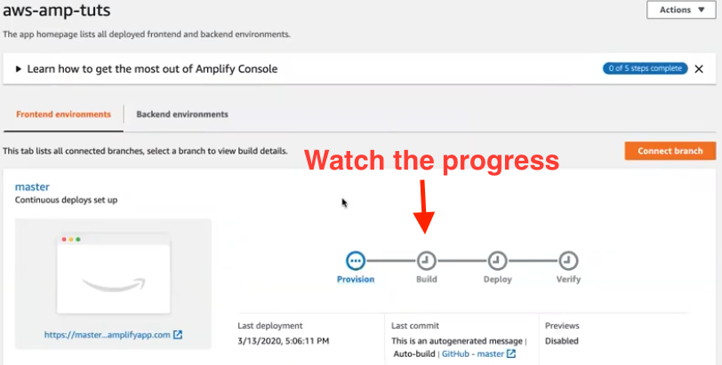

# AWS Amplify - Deploy Frontend React App

A walk through of one of the coolest new deployment platforms out there, Lab
Standards compliant AWS Amplify.

## Objective

We will walk through the deployment of a front end react app on AWS
Amplify, one of the approved services in the [Labs Standards](https://lambda-school-labs.github.io/labs-engineering-standards/).
The deployment will have automatic deploys upon merge to master. In addition
we will cover the steps to setup Previews that will be generated when a PR is
created.

### Technologies

- [AWS Management Cosole](https://console.aws.amazon.com)
- [github.com](https://github.com)

### References

- [AWS Amplify](https://aws.amazon.com/amplify/)

### Pre-requsites

- You will need to have an [AWS account](https://console.aws.amazon.com)
- a [github.com](https://github.com) account

## Setup master deployment

- create a blank github repo
- create a base react app using create-react-app
  > `> npx create-react-app awesomeness-aws-app`
  >
  > `> cd awesomeness-aws-app`

- Initialize the git repo and set origin to the new repo
  > `> git init`
  >
  > `> git remote add origin <new repo url>`

- Initialize the react project and confirm it works
  > `> yarn; yarn start; open http://localhost:3000`

- Push the repo to github
  > `> git push origin master`

- Open the AWS Amplify console and connect an app. Choose to connect existing
  code from github and enter your `master` branch
  
  
  
!!! Info
    You will need to authorize aws with github to gain access. This is similar
    to services like netlify and Heroku.
  
    

- Save the default settings and watch the deploy
  

- open your browser to the url amplify setup for you to confirm you have a
Labs Standards compliant site running. 🎉

## Setup Previews

Similar to [Heroku Review apps](https://devcenter.heroku.com/articles/github-integration-review-apps)
AWS Amplify can create resources to serve up your app based on a PR.

- Open Previews from the side bar
- Click to enable Previews
  

!!! Warning
    You will need to install a Github app to enable previews. Either your SL or
    Engineering Manager will need to do this for you repo.

    

- After installing the github app open the preview for `master` branch and
  enable PR previews
  
  

- All set. Now go commit a change to your project and push to a new branch so you
  can create a PR.
- You should see a "github check" for `AWS Amplify Console Web Preview` in your
  PR Conversation view.
  

- It will take a few minutes to create your app in AWS but when it's done a
  link to the site will appear in the previews list.
  

- Open the PR url and see your changes live.
- When you merge your PR AWS Amplify will destroy the preview and automagically
  deploy master to the production resources. 🎉🎉

### A video walk-through of this entire process

<!-- markdownlint-disable MD033 MD013 -->
<iframe width="560" height="315" src="https://www.youtube.com/embed/L4-3xDjOJ8g" frameborder="0" allow="accelerometer; autoplay; encrypted-media; gyroscope; picture-in-picture" allowfullscreen></iframe>
<!-- markdownlint-enable MD033 -->
