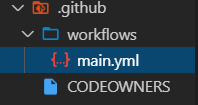

# Github Actions

## Objective
Provide an introduction to github actions, continuous integrations, and continuous delivery

## Technologies
- Github

### What are Github Actions
- Github actions provide developers the ability to automate routine and necessary tasks
- When a user interacts with a Github repository an event triggers (eg. push request, pull request, merge requests). Developers can use these events to start an automated workflow — A git hub container with a set of instructions or actions.
- Rather than write actions from scratch, the most common actions have been provided by the Github community each on a repository capable of being forked and modified.

- Common use cases for GitHub Actions include Continuous Integration, and Continuous Deployment

### Setting up GitHub Actions
- For every repository on GitHub there is an actions tab, which provides a log of every action performed on the server
- In your repo .githib folder you will need to have a workflows folder, with each workflow as a .yml file.  GitHub will automatically recognize all .yml files in this folder as workflows.

- For each workflow you will want to make a separate .yml folder

### Parts of a YML File
- Example .YML folder

- The "name:" declares the name of the workflow
- The "on:" declares the events that trigger the workflow. In example, the workflow will be triggered whenever the user makes a pull request, or pushes to the master branch
- The "jobs:" declares the actions that will occur when a triggering event occurs. The next level of indent declares the name.
- The "runs-on:" determines what operating system you wish to run on the GitHub virtual machine (Where the actions are being performed on GitHub)   
- The "env:" establishes environmental configuration, often for establishing secrets, such as this case. PERSONAL_TOKEN is the name we gave our secret on the repository. A new secret can be added by going to settings on your repository-> Secrets -> New Secret(see image below).
- The "steps:" list the set of instructions for the action
- The first two actions are official actions that get our source code into the virtual machine (actions/checkout@v1) and setting up node (actions/setup-node@master). You will see these pretty often and most of your workflows will probably start with these.
- The rest of the actions you see are custom scripts, or setting up the environment for this project and will vary from project to project. This is a simple continuos deployment example.
- In this example, we are installing markdownlint to test the formatting of our markdown files, we are setting up a python environment, and we then run a python program called mkdocs that builds simple website from our markdown files. If it was pushed, we then we set up continuous deployment  to deploy to github pages.
- 
### Continuos Deployment
- The example above was an example of using GitHub Actions for continuous deployment.
- The purpose of continuous deployment is to push the code that we have written to our customers or a third party quickly and automatically. This allows features and bug fixes to be applied multiple times a day, once it passes our Quality Assurance checks.

### Example- Continuous Integration
- The purpose of continuos integration is to streamline the process to merge developer's code multiple times per day.
- For continuous integration to work, every time a pull request is made, GitHub will run test script(s), and if any tests or the build fails, the actions will have a red x letting us know not to merge the pull request
- The code here uses at the community action paanbati/codeclimate-action to integrate with the Lambda Labs code climate.
- Should any tests fail upon a pull request it will be apparent before merging
- An in depth walkthrough of writing the test scripts is forthcoming 
 <!--- Replace this with a link when it is written --->
 

<!--- 
### Continuous Deployment
- Example of Continuos Deployment goes here!
- Purpose is to push code to your customers
- Integrate Third party host
- You can add secrets to your github repo for integration with third party services
- Create a new .yml file and have it on: push: branches:[master]
- use the third party action associated with it
--->